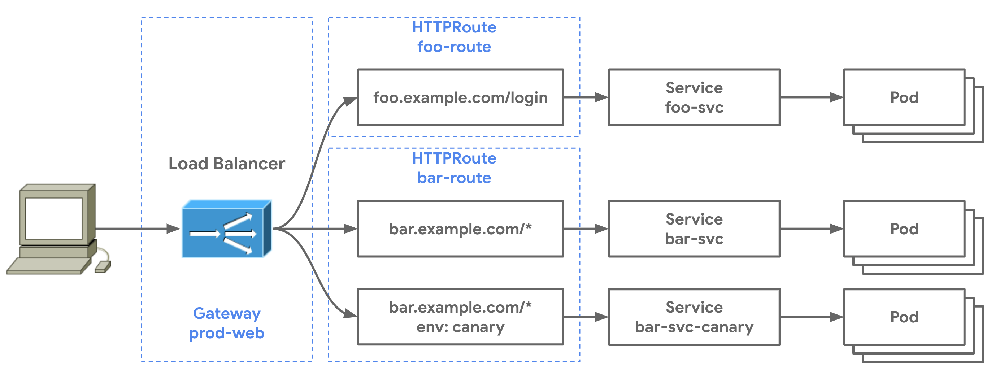

## 前置资料

> Gateway API 是一个类似 [Ingress](https://kubernetes.io/zh-cn/docs/concepts/services-networking/ingress/) 的正式 Kubernetes API。 Gateway API 代表了 Ingress 功能的一个父集，使得一些更高级的概念成为可能。 与 Ingress 类似，Kubernetes 中没有内置 Gateway API 的默认实现。 相反，有许多不同的[实现](https://gateway-api.sigs.k8s.io/implementations/)可用，在提供一致且可移植体验的同时，还在底层技术方面提供了重要的选择。 查看 [API 概念文档](https://gateway-api.sigs.k8s.io/concepts/api-overview/) 并查阅一些[指南](https://gateway-api.sigs.k8s.io/guides/getting-started/)以开始熟悉这些 API 及其工作方式。 当你准备好一个实用的应用程序时， 请打开[实现页面](https://gateway-api.sigs.k8s.io/implementations/)并选择属于你可能已经熟悉的现有技术或集群提供商默认使用的技术（如果适用）的实现。 Gateway API 是一个基于 [CRD](https://kubernetes.io/zh-cn/docs/tasks/extend-kubernetes/custom-resources/custom-resource-definitions/) 的 API，因此你将需要[安装 CRD](https://gateway-api.sigs.k8s.io/guides/getting-started/#install-the-crds) 到集群上才能使用该 API。

##### **[简单的网关](https://gateway-api.sigs.k8s.io/guides/simple-gateway/#deploying-a-simple-gateway "简单的网关")**

[](https://gateway-api.sigs.k8s.io/images/single-service-gateway.png)

##### **[HTTP 路由](https://gateway-api.sigs.k8s.io/guides/http-routing/ "HTTP 路由")**

[](https://gateway-api.sigs.k8s.io/images/http-routing.png)

##### **[跨命名空间路由](https://gateway-api.sigs.k8s.io/guides/multiple-ns/#cross-namespace-routing "跨命名空间路由")**

[](https://gateway-api.sigs.k8s.io/images/cross-namespace-routing.svg)

##### **[HTTP 重定向与重写](https://gateway-api.sigs.k8s.io/guides/http-redirect-rewrite/ "HTTP 转发与重定向")**

##### **[gRPC路由](https://gateway-api.sigs.k8s.io/guides/grpc-routing/#grpc-routing "gRPC路由")**

[](https://gateway-api.sigs.k8s.io/images/grpc-routing.png)

##### **[从Ingress迁移](https://gateway-api.sigs.k8s.io/guides/migrating-from-ingress/#migrating-from-ingress "从Ingress迁移")**

* * *

* * *

* * *

## 个人理解

- Kubernetes Service APIs技术抽象出了`GatewayClass`、`Gateway`、`HTTPRoute`、`TCPRoute`、`UDPRoute`、`GRPCRoute`、`TLSRoute`
    
    - Ingress提供了K8S统一入口和动态配置负载均衡的功能，这已经解决了在运维层面的上的访问问题
        
        - 但在实际业务中，我们的应用程序有很多自定义的业务逻辑都是基于网关进行设定的，如：用户鉴权等
        - Ingress并不能够提供灵活的业务配置，这会在实际使用过程中，加入额外的自定义网关，这会让Ingress降低了它本有的负载能力
        - 之后当服务网格的出现，解决了运维与业务逻辑解耦的问题，但学习成本和维护成本都不低，直到当下，Kubernetes又加入了 `Gateway API` 这样的设计
- `Gateway API`，从实际使用上来看，它与`Istio`的配置使用方式非常相似，并且可以灵活选择不同的`API网关`，如：
    
    - #### Implementation Status[¶](https://gateway-api.sigs.k8s.io/implementations/#implementation-status)
        
        - [Acnodal EPIC](https://gateway-api.sigs.k8s.io/implementations/#acnodal-epic) (public preview)
        - [Apache APISIX](https://gateway-api.sigs.k8s.io/implementations/#apisix) (alpha)
        - [BIG-IP Kubernetes Gateway](https://gateway-api.sigs.k8s.io/implementations/#big-ip-kubernetes-gateway)
        - [Cilium](https://gateway-api.sigs.k8s.io/implementations/#cilium) (beta)
        - [Contour](https://gateway-api.sigs.k8s.io/implementations/#contour) (beta)
        - [Emissary-Ingress (Ambassador API Gateway)](https://gateway-api.sigs.k8s.io/implementations/#emissary-ingress-ambassador-api-gateway) (alpha)
        - [Envoy Gateway](https://gateway-api.sigs.k8s.io/implementations/#envoy-gateway) (alpha)
        - [Flomesh Service Mesh](https://gateway-api.sigs.k8s.io/implementations/#flomesh-service-mesh-fsm) (work in progress)
        - [Gloo Edge 2.0](https://gateway-api.sigs.k8s.io/implementations/#gloo-edge) (work in progress)
        - [Google Kubernetes Engine](https://gateway-api.sigs.k8s.io/implementations/#google-kubernetes-engine) (GA)
        - [HAProxy Ingress](https://gateway-api.sigs.k8s.io/implementations/#haproxy-ingress) (alpha)
        - [HashiCorp Consul](https://gateway-api.sigs.k8s.io/implementations/#hashicorp-consul)
        - [Istio](https://gateway-api.sigs.k8s.io/implementations/#istio) (beta)
        - [Kong](https://gateway-api.sigs.k8s.io/implementations/#kong) (beta)
        - [Kuma](https://gateway-api.sigs.k8s.io/implementations/#kuma) (alpha)
        - [LiteSpeed Ingress Controller](https://gateway-api.sigs.k8s.io/implementations/#litespeed-ingress-controller)
        - [NGINX Kubernetes Gateway](https://gateway-api.sigs.k8s.io/implementations/#nginx-kubernetes-gateway)
        - [STUNner](https://gateway-api.sigs.k8s.io/implementations/#stunner) (beta)
        - [Traefik](https://gateway-api.sigs.k8s.io/implementations/#traefik) (alpha)
    - #### Integration Status[¶](https://gateway-api.sigs.k8s.io/implementations/#integration-status)
        
        - [Flagger](https://gateway-api.sigs.k8s.io/implementations/#flagger) (public preview)
        - [cert-manager](https://gateway-api.sigs.k8s.io/implementations/#cert-manager) (alpha)
- 接下来，一起逐步的尝试使用一下
    

## [安装 MetalLB](http://www.dev-share.top/2020/08/14/%e4%bd%bf%e7%94%a8metallb%e6%9d%a5%e8%a7%a3%e5%86%b3k8s-service-loadbalancer%e9%97%ae%e9%a2%98/)

## [安装 contour gateway](https://projectcontour.io/getting-started/)

```shell
wget --no-check-certificate https://projectcontour.io/quickstart/contour-gateway-provisioner.yaml

kubectl apply -f contour-gateway-provisioner.yaml

```

### 使用 GatewayClass、Gateway、HTTPRoute，链接Service，访问Pod后端服务

### 1\. 创建配置文件

```shell
cat > gateway-config.yaml << ERIC

## 1. GatewayClass 用来接入 contour 服务器
## GatewayClass是全局的 不需要指定命令空间
---
kind: GatewayClass
apiVersion: gateway.networking.k8s.io/v1beta1
metadata:
  name: contour-gateway-class
spec:
  controllerName: projectcontour.io/gateway-controller

## 2. Gateway 用来绑定 GatewayClass，用来拦截流量进入时的，请求协议与端口
## Gateway默认情况下会与 contour 服务器，在同一个命名空间中
---
kind: Gateway
apiVersion: gateway.networking.k8s.io/v1beta1
metadata:
  name: contour-gateway
  namespace: projectcontour
spec:
  # 指定 GatewayClass
  gatewayClassName: contour-gateway-class
  listeners:
    - name: http
      protocol: HTTP
      port: 80
      allowedRoutes:
        namespaces:
          from: All


## 3. HTTPRoute 将Gateway的流量衔接到具体的 Service
## HTTPRoute 要与你的应用程序写在同一个命名空间中
---
apiVersion: gateway.networking.k8s.io/v1beta1
kind: HTTPRoute
metadata:
  name: foo-route
  namespace: default
spec:
  # 指定 Gateway
  parentRefs:
  - name: contour-gateway
  hostnames:
  - "httpd.example.com"
  rules:
  - matches:
    - path:
        type: PathPrefix
        value: /
    backendRefs:
    # 指定 Service
    - name: my-httpd
      port: 80


## 4. 部署测试程序
---
apiVersion: v1
kind: Service
metadata:
  labels:
    app: my-httpd
  name: my-httpd
  namespace: default
spec:
  ports:
  - port: 80
    protocol: TCP
    targetPort: 80
  selector:
    app: my-httpd

---
apiVersion: apps/v1
kind: Deployment
metadata:
  labels:
    app: my-httpd
  name: my-httpd
  namespace: default
spec:
  replicas: 1
  selector:
    matchLabels:
      app: my-httpd
  template:
    metadata:
      labels:
        app: my-httpd
    spec:
      containers:
      - image: httpd:alpine3.15
        name: apache-httpd
        ports:
        - containerPort: 80


ERIC


## 部署
kubectl apply -f gateway-config.yaml

```

### 2\. 查看信息

```shell
[root@k8s-master ~]# kubectl get -f gateway-config.yaml -o wide


## GatewayClass
NAME                                                           CONTROLLER                             ACCEPTED   AGE   DESCRIPTION
gatewayclass.gateway.networking.k8s.io/contour-gateway-class   projectcontour.io/gateway-controller   True       24s


## Gateway
NAME                                                CLASS                   ADDRESS        PROGRAMMED   AGE
gateway.gateway.networking.k8s.io/contour-gateway   contour-gateway-class   192.168.0.50   True         24s


## HTTPRoute
NAME                                            HOSTNAMES               AGE
httproute.gateway.networking.k8s.io/foo-route   ["httpd.example.com"]   24s


## Service
NAME               TYPE        CLUSTER-IP     EXTERNAL-IP   PORT(S)   AGE   SELECTOR
service/my-httpd   ClusterIP   10.96.121.45   <none>        80/TCP    24s   app=my-httpd


## Deployment
NAME                       READY   UP-TO-DATE   AVAILABLE   AGE   CONTAINERS     IMAGES             SELECTOR
deployment.apps/my-httpd   1/1     1            1           24s   apache-httpd   httpd:alpine3.15   app=my-httpd


```

### 3\. 测试访问

```shell
[root@k8s-master ~]# curl -H "Host: httpd.example.com" http://192.168.0.50/

<html><body><h1>It works!</h1></body></html>

```

* * *

* * *

* * *
