# ESP8266 固件开发

> ESP-01S 是一款基于 ESP8266 芯片的 Wi-Fi 模块，通常用于物联网项目和嵌入式系统中。

* * *

## 硬件准备

- 烧录器
    
    - 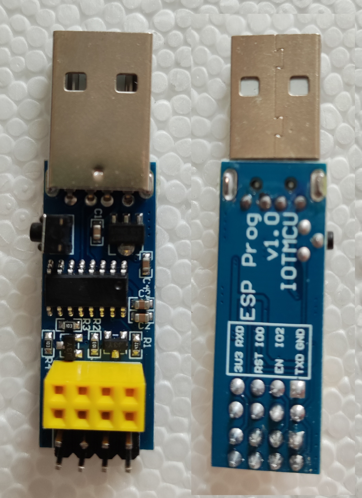
- ESP8266 WIFI模块。
    
    - 它是一个低成本的WiFi模块，它本身具备搜索附近`AP(热点)的功能`通过`AT`命令可以连接到附近的`AP`。
    - 通过简单的编程就可以实现运行独立的Web服务器。
    - 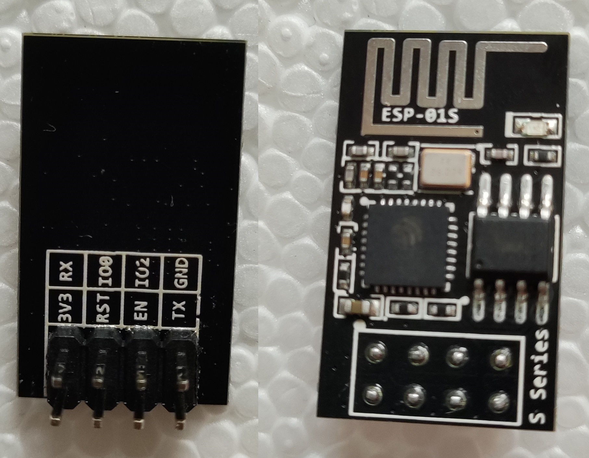

* * *

* * *

* * *

## 开发应用程序

- ### 安装串口驱动 [下载驱动](http://qiniu.dev-share.top/iot/%E7%83%A7%E5%BD%95%E4%B8%8B%E8%BD%BD%E5%99%A8%E9%A9%B1%E5%8A%A8-CH341SER.zip)
    
    - 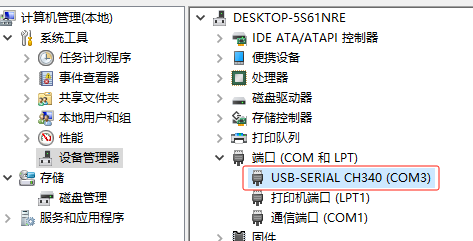
- ### 下载开发工具 [Arduino](http://qiniu.dev-share.top/iot/arduino-ide_2.2.1_Windows_64bit.zip)。
    
    - 汉化：`进入【File】->【Preferences】-> 【language】，将其改为【中文简体】`
    - 添加开发模板：https://arduino.esp8266.com/stable/package\_esp8266com\_index.json
    - 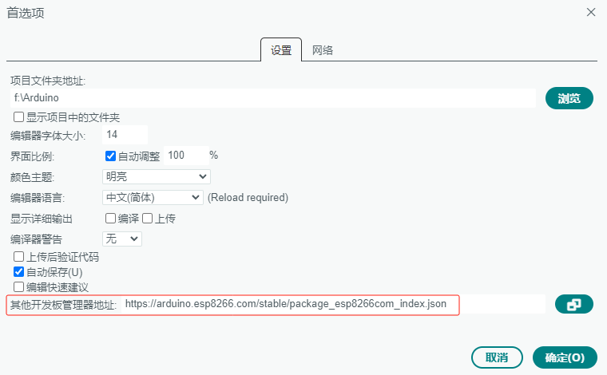
- ### 引入依赖库
    
    - 本示例中我们需要用到 DHT 第三方库 `DHT sensor library` 进入`【项目】->【导入库】-> 【管理库】`
        
    - 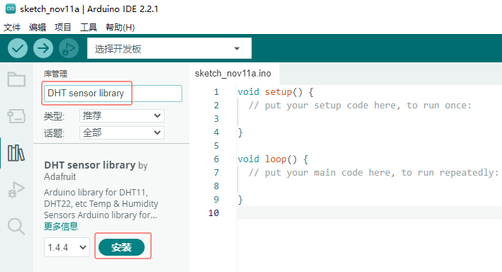
        
    - 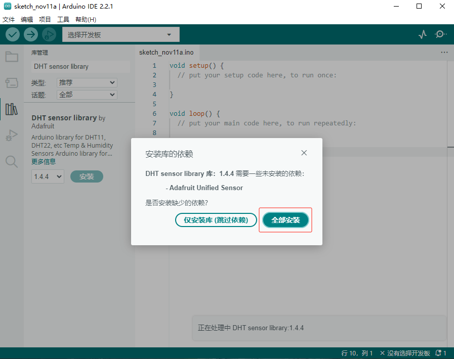
        
- ### 安装开发板
    
    - #### 配置代理(不配置本地代理根本没法下载)
        
    - 
        
    - #### 打开`【工具】->【开发板】->【开发板管理器】`
        
    - 
        
    - #### 查看下载的文件
        
    - `Win + R` 输入 `%LOCALAPPDATA%/Arduino15/packages`
        
    - 
        
    - #### 选择`开发板`与`串口`
        
    - 
        
- ### 测试串口
    
    - #### 插入模块到USB
        
    - 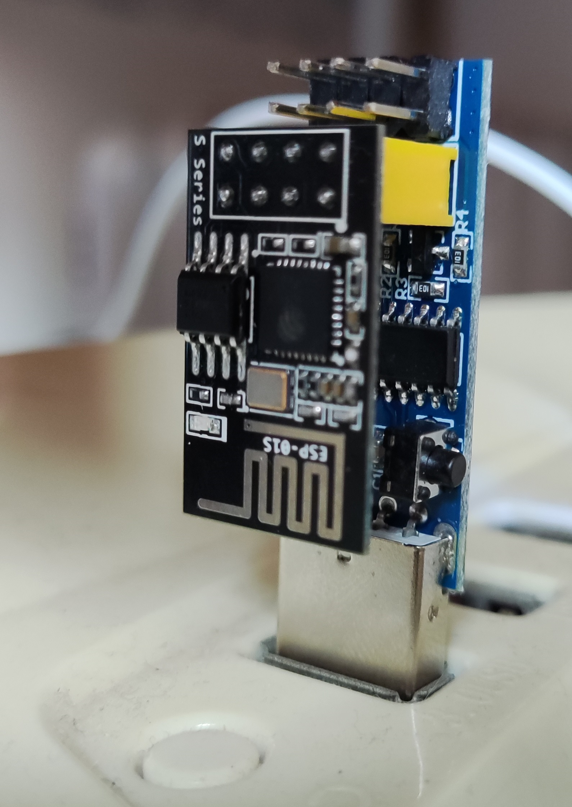
        
    - #### 选择串口
        
    - 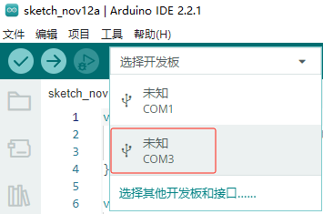
        
    - 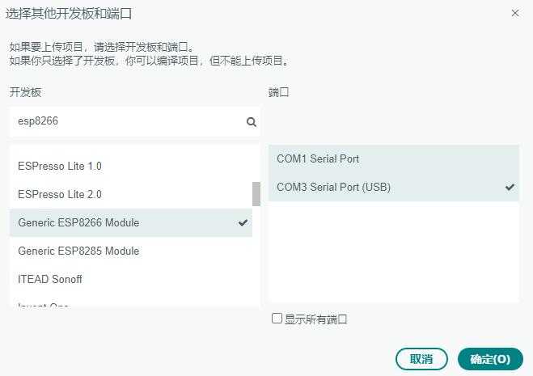
    - 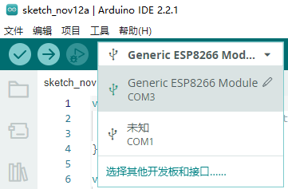
        
    - #### 测试
        
    - 选择`串口监视器` --> 输入命令 `AT+GMR`
        
    - 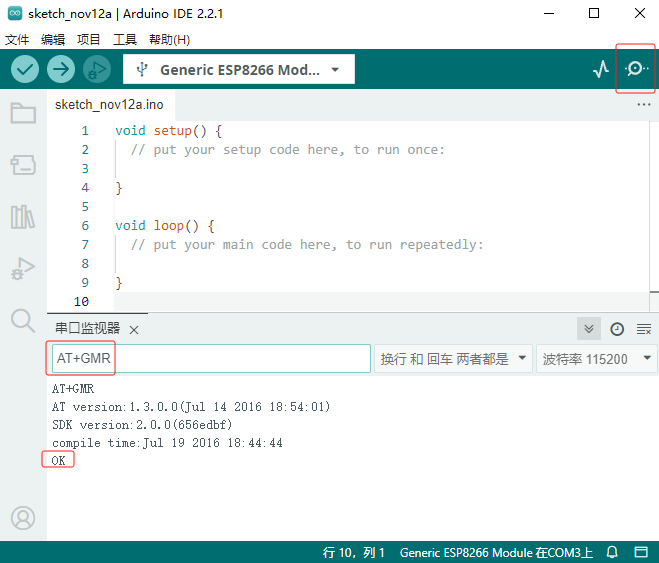
- ### 编写代码：
    

- 编写一个简单的Web页面。
    
    ```cpp
    #include <ESP8266WiFi.h>         // 引入ESP8266 WiFi库
    #include <ESP8266WebServer.h>    // 引入ESP8266 Web服务器库
    
    #ifndef STASSID
    #define STASSID "Redmi K40S"      // 默认的WiFi名称
    #define STAPSK "88888888"         // 默认的WiFi密码
    #endif
    
    const char *ssid = STASSID;       // 设置WiFi名称
    const char *password = STAPSK;    // 设置WiFi密码
    
    ESP8266WebServer server(80);      // 创建一个Web服务器实例，监听端口80
    
    // handleRoot 是一个处理根路径("/")请求的函数。
    void handleRoot() {
      server.send(200, "text/html", "<h1>Hello from ESP8266!</h1>");  // 处理根路径的请求，返回一个简单的HTML响应
    }
    
    // setup 方法在程序开始时执行一次，用于进行一次性的初始化设置。
    void setup() {
      Serial.begin(115200);           // 初始化串口通信，波特率为115200
    
      WiFi.mode(WIFI_STA);            // 设置ESP8266为Station模式
      WiFi.begin(ssid, password);     // 连接WiFi网络
    
      while (WiFi.status() != WL_CONNECTED) {  // 等待WiFi连接成功
        delay(500);
        Serial.print(".");
      }
    
      Serial.println("");
      Serial.print("Connected to ");
      Serial.println(ssid);
      Serial.print("IP address: ");
      Serial.println(WiFi.localIP());  // 打印连接的WiFi网络信息
    
      server.on("/", HTTP_GET, handleRoot);  // 处理根路径的GET请求，调用handleRoot函数
      server.begin();                        // 启动Web服务器
    }
    
    // loop 方法会持续循环执行，用于处理主要的程序逻辑。
    void loop() {
      server.handleClient();  // 处理Web服务器的客户端请求
    }
    
    ```
    
- 将代码上传到设备(**烧录**)
    
    - 先将点击上传按钮等待上传完成，然后点击串口监视器
    - 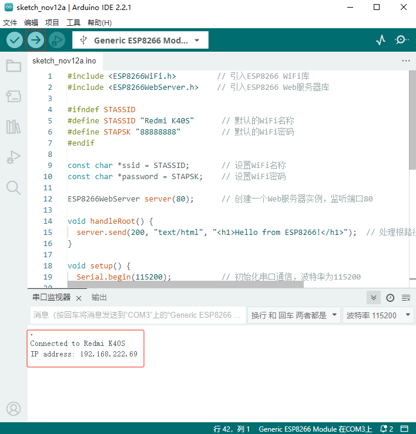
    - 成功后会看到连接的WiFi网络信息。
- 使用手机访问这个IP
    
    - 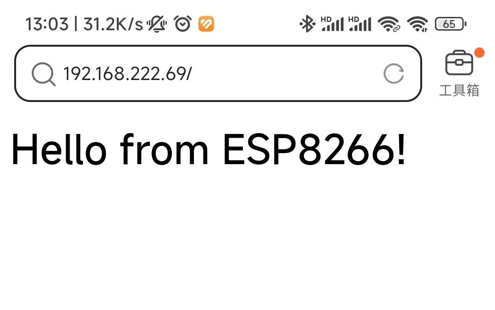

* * *

## 总结

> 通过将编写好的代码上传到`ESP8266`模块后就可以链接网络了 使用`Arduino IED`开发工具上传代码的动作就是 **`烧录`** 不需要在使用其它软件进行烧录了 使用其它软件的烧录目的是批量烧录设备，所以开发完的程序是要先将程序导出为`已编译的二进制文件`(项目 --> 已编译的二进制文件)， 然后使用烧录工具对设置进行批量烧录

* * *

* * *

* * *

## [WIFI温湿度传感器接入](http://www.dev-share.top/2023/11/12/wifi%e6%b8%a9%e6%b9%bf%e5%ba%a6%e4%bc%a0%e6%84%9f%e5%99%a8%e6%8e%a5%e5%85%a5/ "WIFI温湿度传感器接入")
