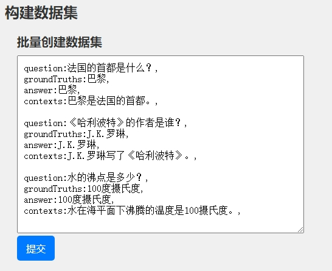
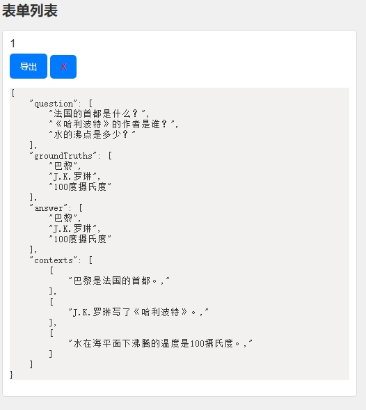

# 构建RAG评测、训练数据库集

## 介绍

> 该小工具旨在简化创建数据集的复杂性。 对于初学者在测试 RAG 系统时存在很多不明之处，使用此工具可以通过简单的字符串拼接来生成 RAGAS 的测试数据集。 同时，也可以将后台代码修改为自动收集 RAG 系统的评估数据。

## 安装教程

```bash
conda create -n ragas python==3.10.12 -c http://172.16.21.146:8081/repository/anaconda-proxy/main --override-channels

pip install -i http://172.16.21.146:8081/repository/pypi/simple  --trusted-host 172.16.21.146 --timeout 0 -r ./requirements.txt
```

## 使用说明

> 使用该工具非常简单。通过一个`静态页面`和一个 `FastAPI 服务端`将简化的数据格式转换为 `RAGAS 数据集`，你可以直接通过浏览器将数据集下载到本地。 运行服务端的 `python main.py` 后，双击打开静态页，即可输入你要转换为数据集的数据。格式如下：

```text
question:法国的首都是什么？,
groundTruths:巴黎,
answer:巴黎,
contexts:巴黎是法国的首都。,

question:《哈利波特》的作者是谁？,
groundTruths:J.K.罗琳,
answer:J.K.罗琳,
contexts:J.K.罗琳写了《哈利波特》。,

question:水的沸点是多少？,
groundTruths:100度摄氏度,
answer:100度摄氏度,
contexts:水在海平面下沸腾的温度是100摄氏度。,
```

#### 点击`提交`进行数据集格式转换



#### 点击`导出`会下载生成的数据集.zip



* * *

# 前端代码

### index.html

```javascript
<!DOCTYPE html>
<html lang="zh">
<head>
    <meta charset="UTF-8">
    <meta name="viewport" content="width=device-width, initial-scale=1.0">
    <title>表单管理</title>
    <style>
        body {
            font-family: Arial, sans-serif;
            margin: 0;
            padding: 0;
            background-color: #f0f0f0;
            color: #333;
        }

        h1, h2 {
            margin-bottom: 10px;
            padding-left: 20px;
        }

        h1 {
            font-size: 24px;
        }

        h2 {
            font-size: 20px;
        }

        form {
            margin-bottom: 20px;
            padding: 0 20px;
        }

        label {
            display: block;
            margin-bottom: 5px;
        }

        textarea {
            width: calc(100% - 40px);
            padding: 10px;
            font-size: 16px;
        }

        input[type="submit"], button {
            padding: 10px 15px;
            font-size: 16px;
            cursor: pointer;
            background-color: #007bff;
            color: #fff;
            border: none;
            border-radius: 5px;
        }

        input[type="submit"]:hover, button:hover {
            background-color: #0056b3;
        }

        ul {
            list-style-type: none;
            padding: 0;
            padding-left: 20px;
        }

        li {
            margin-bottom: 10px;
            padding: 10px;
            background-color: #fff;
            border: 1px solid #ddd;
            border-radius: 5px;
        }

        li:last-child {
            margin-bottom: 0;
        }

        section {
            margin: 20px;
        }

        /* 样式按钮 */
        .export-button {
            font-size: 12px; /* 更改按钮大小 */
        }

        .delete-button {
            color: red; /* 将删除按钮颜色更改为红色 */
            font-size: 12px; /* 将删除按钮大小更改为与导出按钮相同 */
        }

        pre {
            background-color: #f3f0f0;
        }
    </style>
</head>

<body>
<header>
    <h1>构建数据集</h1>
</header>

<section>
    <h2>批量创建数据集</h2>
    <form id="createDataSet">
        <textarea id="formData" name="formData" rows="15" cols="50" placeholder="question:法国的首都是什么？,
groundTruths:巴黎,
answer:巴黎,
contexts:巴黎是法国的首都。,

question:《哈利波特》的作者是谁？,
groundTruths:J.K.罗琳,
answer:J.K.罗琳,
contexts:J.K.罗琳写了《哈利波特》。,

question:水的沸点是多少？,
groundTruths:100度摄氏度,
answer:100度摄氏度,
contexts:水在海平面下沸腾的温度是100摄氏度。,
"></textarea>
        <input type="submit" value="提交">
    </form>
</section>

<section>
    <h2>表单列表</h2>
    <ul id="formsList"></ul>
</section>

<script>

    class ajax {
        static baseURL = '';

        /**
         * 发起请求
         * @param url
         * @param options
         * @returns {Promise<any>}
         */
        static async request(url, options) {
            let response = await fetch(`${ajax.baseURL}${url}`, options);
            return response.json();
        }

        /**
         *
         * @param url
         * @returns {Promise<*>}
         */
        static async get(url) {
            return ajax.request(url, {});
        }

        /**
         *
         * @param url
         * @param data
         * @returns {Promise<*>}
         */
        static async post(url, data) {
            let options = {
                method: 'POST',
                headers: {
                    'Content-Type': 'application/json',
                },
                body: JSON.stringify(data),
            };
            return ajax.request(url, options);
        }

        /**
         *
         * @param url
         * @returns {Promise<*>}
         */
        static async delete(url) {
            let options = {
                method: 'DELETE',
            };
            return ajax.request(url, options);
        }
    }
</script>
<script>

    ajax.baseURL = 'http://localhost:8000'


    /**
     * 显示表单列表
     * @returns {Promise<void>}
     */
    async function displayForms() {
        let formsList = document.getElementById('formsList');
        formsList.innerHTML = '';
        let result = await ajax.get('/dataset/');
        result.forEach(r => {
            let listItem = `
            <li>
                <label>${r.pid}</label>
                <button class="export-button" onclick="exportDataset(${r.pid})">导出</button>
                <button class="delete-button" onclick="deleteDataset(${r.pid})">X</button>
                <pre>${JSON.stringify(r.data, null, 4)}</pre>
            </li>
            `;

            formsList.insertAdjacentHTML('beforeend', listItem)
        });
    }

    /**
     * 创建数据集
     */
    document.getElementById('createDataSet').addEventListener('submit', async (event) => {
        event.preventDefault();
        let formData = document.getElementById('formData').value.trim();
        if (!formData) return
        // 向服务端发起请求
        await ajax.post('/dataset/ragas', {data: formData});
        // // 向服务端发起请求
        // await ajax.post('/dataset/chatglm', {data: formData});
        // 刷新表单列表
        await displayForms();
    });


    /**
     * 导出数据集
     * @param pid
     * @returns {Promise<void>}
     */
    async function exportDataset(pid) {

        try {
            // 通过 AJAX 请求获取数据压缩包
            let response = await fetch(`${ajax.baseURL}/export-dataset/${pid}`);

            // 检查响应状态码
            if (!response.ok) {
                throw new Error('导出数据失败');
            }

            // 读取响应的数据流
            let blob = await response.blob();

            // 创建一个链接元素以下载文件
            let url = URL.createObjectURL(blob);
            let a = document.createElement('a');
            a.href = url;
            // 设置下载的文件名为 data.zip
            a.download = `data_${pid}.zip`;
            // 模拟点击链接以触发下载
            a.click();
        } catch (error) {
            // 如果出现错误，则显示导出数据失败的警告
            alert(error.message);
        }
    }


    /**
     * 删除数据集
     * @param pid
     * @returns {Promise<void>}
     */
    async function deleteDataset(pid) {
        try {
            await fetch(`${ajax.baseURL}/dataset/${pid}/`, {method: 'DELETE'});
            await ajax.delete(`/dataset/${pid}/`);
            await displayForms(); // 删除成功后刷新表单列表
        } catch (error) {
            alert('删除数据集失败：' + error.message);
        }
    }

    // 初始化页面
    displayForms();
</script>
</body>
</html>

```

# 后端代码

### main.py

```python
import re

from fastapi import FastAPI
from fastapi.middleware.cors import CORSMiddleware

from sqlite3_db import Database

app = FastAPI()

# 创建数据库实例
db = Database()

# 添加跨域资源共享中间件，允许跨域请求
app.add_middleware(
    CORSMiddleware,
    allow_origins=["*"],  # 允许所有来源
    allow_credentials=True,  # 允许凭证
    allow_methods=["*"],  # 允许所有 HTTP 方法
    allow_headers=["*"],  # 允许所有 HTTP 头部
)


# FastAPI 端点
@app.post("/dataset/ragas", response_model=int)
def create_dataset(param: dict):
    # 初始化目标字典
    data = {
        "question": [],
        "groundTruths": [],
        "answer": [],
        "contexts": []
    }

    # 使用正则表达式将两个以上的连续换行符进行分割
    items = re.split(r'\n{2,}', param["data"])

    # 将每个对象转换成字典格式
    for item in items:
        for entry in item.split(',\n'):
            key, value = entry.split(':', 1)
            if key == 'contexts':
                value = [value]
            data[key].append(value)

    # 创建数据集
    db.insert_forms(data)
    return db.cursor.lastrowid


# @app.post("/dataset/chatglm", response_model=int)
# def create_dataset(data: dict):
#     # 创建数据集
#     db.insert_forms(data)
#     return db.cursor.lastrowid


@app.get("/dataset/")
def query_dataset():
    # 查询数据集
    return db.query_dataset()


@app.get("/export-dataset/{pid}")
def export_dataset(pid: str):
    # 导出数据集
    return db.export_dataset(pid)


# 删除数据集
@app.delete("/dataset/{pid}/")
def delete_dataset(pid: int):
    # 删除数据集
    return db.delete_dataset(pid)


if __name__ == "__main__":
    import uvicorn

    # 运行服务器
    uvicorn.run(app, host="0.0.0.0", port=8000)

```

### sqlite3\_db.py

```python
import json
import os.path
import shutil
import sqlite3
import tempfile

from fastapi.responses import FileResponse
from pydantic import BaseModel, Field

from datasets import Dataset


# 定义请求和响应数据的 Pydantic 模型
class FormData(BaseModel):
    question: list[str]
    ground_truths: list[str] = Field(alias="groundTruths")
    answer: list[str]
    contexts: list[list[str]]


class Database:
    def __init__(self, db_name='dataset.db'):
        self.conn = sqlite3.connect(db_name, check_same_thread=False)
        self.cursor = self.conn.cursor()
        self.create_table()

    def create_table(self):
        # 创建表格
        self.cursor.execute('''
        CREATE TABLE IF NOT EXISTS datasets (
            pid INTEGER PRIMARY KEY AUTOINCREMENT,
            data TEXT
        )
        ''')
        self.conn.commit()

    def insert_forms(self, data: dict):
        # 将字典数据转换为 JSON 字符串
        json_data = json.dumps(data)

        # 向表格中插入数据
        sql = """
            INSERT INTO datasets (data)
            VALUES (?)
        """
        self.cursor.execute(sql, (json_data,))
        self.conn.commit()

    def delete_dataset(self, pid: str):
        # 删除数据集
        sql = f"""
        DELETE FROM datasets WHERE pid = {pid}
        """
        self.cursor.execute(sql)
        self.conn.commit()

    def query_dataset(self):
        # 查询数据集
        sql = """
        SELECT pid, data FROM datasets ORDER BY pid DESC
        """
        self.cursor.execute(sql)
        results = self.cursor.fetchall()

        # 将每个结果转换为 Python 字典并存储在列表中
        result_list = []
        for row in results:
            data_dict = {"pid": row[0], "data": json.loads(row[1])}
            result_list.append(data_dict)  # 将 Python 字典添加到结果列表中

        return result_list

    def export_dataset(self, pid: str):
        # 查询数据集
        sql = f"""
        SELECT data FROM datasets WHERE pid = {pid}
        """
        self.cursor.execute(sql)
        results = self.cursor.fetchall()[0][0]

        # 将字符串 result 解析为字典对象
        result_dict = json.loads(results)
        # 使用字典创建 Dataset 对象
        dataset = Dataset.from_dict(result_dict)

        # 创建临时目录
        temp_dir = tempfile.mkdtemp()

        file_path = os.path.join(temp_dir, f"data_{pid}")
        print(file_path)
        # 保存数据集到临时目录
        dataset.save_to_disk(file_path)

        # 创建压缩文件
        zip_file_path = shutil.make_archive(base_name=file_path, root_dir=file_path, format='zip')
        print(zip_file_path)

        # 返回压缩文件给浏览器端
        result_zip = FileResponse(zip_file_path, media_type="application/zip")

        return result_zip

```

## 依赖

### requirements.txt

```txt
aiohttp==3.9.3
aiosignal==1.3.1
annotated-types==0.6.0
anyio==4.3.0
async-timeout==4.0.3
attrs==23.2.0
certifi==2024.2.2
charset-normalizer==3.3.2
click==8.1.7
colorama==0.4.6
datasets==2.18.0
dill==0.3.8
exceptiongroup==1.2.0
fastapi==0.110.0
filelock==3.13.3
frozenlist==1.4.1
fsspec==2024.2.0
h11==0.14.0
huggingface-hub==0.22.1
idna==3.6
multidict==6.0.5
multiprocess==0.70.16
numpy==1.26.4
packaging==24.0
pandas==2.2.1
pyarrow==15.0.2
pyarrow-hotfix==0.6
pydantic==2.6.4
pydantic_core==2.16.3
python-dateutil==2.9.0.post0
pytz==2024.1
PyYAML==6.0.1
requests==2.31.0
six==1.16.0
sniffio==1.3.1
starlette==0.36.3
tqdm==4.66.2
typing_extensions==4.10.0
tzdata==2024.1
urllib3==2.2.1
uvicorn==0.29.0
xxhash==3.4.1
yarl==1.9.4
```
